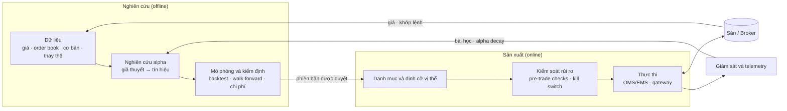

# 04 — Kiến trúc tham chiếu của một hệ thống quant

> Cập nhật: 2026-10-01 · Kiến trúc **tổng quát** theo thực hành chung của ngành, dùng làm khung để đối chiếu với hệ thống thật của bạn.
> Phần kiểm kê hệ thống thực tế trên máy của bạn nằm ở [00 — Kiểm kê](00-kiem-ke.md).

## 1. Sơ đồ tổng thể

Hai nửa của hệ thống có yêu cầu khác nhau:

- **Nghiên cứu (offline):** ưu tiên tốc độ thử nghiệm và tính tái lập; sai sót ở đây tốn thời gian.
- **Sản xuất (online):** ưu tiên độ tin cậy, quan sát được và an toàn; sai sót ở đây tốn tiền.

## 2. Bảy lớp và nhiệm vụ

| Lớp | Nhiệm vụ | Thành phần điển hình | Đầu ra | Lỗi hay gặp |
|---|---|---|---|---|
| **1. Dữ liệu** | Thu thập, làm sạch, lưu trữ, cấp dữ liệu *point-in-time* | feed/API, kho chuỗi thời gian (file parquet/CSV hoặc cơ sở dữ liệu), danh mục mã và lịch giao dịch | bộ dữ liệu có phiên bản | look-ahead, survivorship bias, lệch múi giờ |
| **2. Nghiên cứu** | Biến giả thuyết thành tín hiệu | notebook/IDE, thư viện đặc trưng (feature), sổ theo dõi thí nghiệm | tín hiệu + hồ sơ giả thuyết | đào dữ liệu không có lý do kinh tế |
| **3. Mô phỏng** | Ước lượng hiệu suất **sau chi phí** | backtester (vector hóa hoặc event-driven), mô hình chi phí/khớp lệnh, khung kiểm định | báo cáo hiệu suất, kiểm tra overfitting | bỏ qua chi phí, tối ưu hóa quá mức |
| **4. Danh mục và rủi ro** | Hợp nhất tín hiệu, định cỡ vị thế, đặt giới hạn | optimizer, volatility targeting, kiểm tra trước giao dịch, kill switch | vị thế mục tiêu | tương quan ẩn giữa các chiến lược; giới hạn nằm *trong* logic chiến lược |
| **5. Thực thi** | Biến vị thế mục tiêu thành lệnh thật | OMS/EMS, gateway (FIX / REST / WebSocket / MetaTrader 5), thuật toán thực thi, đối chiếu sau giao dịch | lệnh, khớp lệnh, vị thế thực | gửi lặp lệnh, không xử lý khớp một phần |
| **6. Vận hành** | Chạy ổn định và quan sát được | scheduler, logging, monitoring/cảnh báo, quản lý bí mật, triển khai, VPS/cloud | log, metric, cảnh báo | bot chết mà không ai biết |
| **7. Quản trị** | Quyết định cái gì được lên chạy tiền thật | version hóa, cổng chuyển giai đoạn, audit trail, tuân thủ | quyết định có hồ sơ | ghi đè lịch sử, bỏ qua forward-test |

## 3. Ba cấu hình tiêu biểu theo quy mô

| | **Cá nhân (MetaTrader 5)** | **Cá nhân/nhóm nhỏ (Python + API)** | **Tổ chức (quỹ, prop, market maker)** |
|---|---|---|---|
| Dữ liệu | Lịch sử của broker; bổ sung nguồn ngoài | Nhà cung cấp dữ liệu + file/DB | Feed trực tiếp từ sàn; kho dữ liệu tick quy mô lớn |
| Nghiên cứu | MQL5 hoặc Python | Python (pandas, numpy, ML) | Python/C++, cơ sở dữ liệu chuỗi thời gian chuyên dụng, cụm tính toán |
| Mô phỏng | Strategy Tester + kiểm định bổ sung bằng Python | Backtester tự viết hoặc thư viện mã nguồn mở | Simulator nội bộ mô phỏng sổ lệnh |
| Rủi ro | Guard trong EA + giới hạn cấp tài khoản | Module rủi ro riêng, kiểm tra trước giao dịch | Hệ thống rủi ro độc lập, đội rủi ro riêng |
| Thực thi | Terminal MT5 ↔ máy chủ broker | REST/WebSocket/FIX tới broker hoặc sàn | FIX hoặc giao thức nhị phân của sàn; DMA; co-location |
| Vận hành | VPS | VPS/cloud + giám sát | Trung tâm dữ liệu, đội vận hành trực 24/7 |
| Quản trị | Git + sổ ghi chép | Git + CI + review | Quy trình phê duyệt, tuân thủ, kiểm toán |

Điểm chung: dù quy mô nào, **bảy lớp đều tồn tại** — ở mức cá nhân, nhiều lớp chỉ là một vài dòng code hoặc một trang ghi chép, nhưng thiếu lớp nào thì rủi ro dồn về lớp đó.

## 4. Tám nguyên tắc thiết kế

1. **Một nguồn sự thật cho logic.** Cùng một mã chạy backtest và live; hai bộ logic song song sớm muộn sẽ lệch nhau.
2. **Tách tín hiệu – rủi ro – thực thi.** Mỗi lớp thay thế được và kiểm thử độc lập.
3. **Giới hạn rủi ro nằm ngoài chiến lược và có quyền phủ quyết.** Chiến lược lỗi không được kéo theo giới hạn lỗi.
4. **Fail-safe.** Mất dữ liệu, mất kết nối hoặc trạng thái không rõ → không mở vị thế mới; xử lý vị thế đang mở theo kế hoạch định sẵn.
5. **Idempotent và có đối chiếu.** Gửi lặp một lệnh không tạo hai vị thế; định kỳ đối chiếu vị thế nội bộ với broker.
6. **Quan sát được.** Mỗi quyết định có log kèm lý do; có metric cho độ trễ, slippage, tỷ lệ từ chối lệnh.
7. **Bất biến và tái lập.** Mỗi phiên bản chiến lược + dữ liệu + cấu hình được lưu để chạy lại ra cùng kết quả; không ghi đè lịch sử.
8. **Triển khai từng bước.** Backtest → forward-test/paper → live quy mô nhỏ → live đầy đủ, mỗi bước có tiêu chí định lượng đặt trước.

## 5. Tự đánh giá kiến trúc của bạn

Trả lời "có / không / chưa rõ" cho từng câu; mỗi "không" hoặc "chưa rõ" là một khoảng trống cần xử lý:

| # | Lớp | Câu hỏi |
|---|---|---|
| 1 | Dữ liệu | Bạn biết chính xác nguồn, phiên bản và độ phủ của dữ liệu đã dùng để kiểm định chưa? |
| 2 | Nghiên cứu | Mỗi chiến lược có hồ sơ giả thuyết (kiếm tiền từ đâu, khi nào hết hiệu lực) không? |
| 3 | Mô phỏng | Backtest có mô hình spread/phí/swap/slippage và chế độ mô phỏng giá đủ chi tiết không? |
| 4 | Mô phỏng | Có quy trình chống overfitting (out-of-sample, walk-forward, ghi số lần thử) không? |
| 5 | Rủi ro | Có giới hạn cấp **tài khoản** áp cho tất cả bot cùng lúc, hay mỗi bot tự lo? |
| 6 | Thực thi | Bạn có đo slippage thật (giá tín hiệu vs giá khớp) và so với giả định backtest không? |
| 7 | Vận hành | Nếu bot hoặc VPS chết lúc 3 giờ sáng, có cảnh báo không? Có kế hoạch xử lý vị thế mở không? |
| 8 | Vận hành | API key và mật khẩu giao dịch được lưu ở đâu, ai truy cập được? |
| 9 | Quản trị | Phiên bản chiến lược có bất biến và so sánh được với nhau không? Tiêu chí lên live là gì (con số cụ thể)? |
| 10 | Quản trị | Nếu phải dựng lại toàn bộ hệ thống từ đầu, mất bao lâu và cần những gì? |

## 6. Thứ tự ưu tiên nâng cấp (gợi ý chung)

1. Giới hạn rủi ro **độc lập** cấp tài khoản và kill switch.
2. Đo chi phí thật (slippage, spread lúc vào lệnh) và đưa vào backtest.
3. Quy trình kiểm định chống overfitting + sổ ghi số lần thử.
4. Telemetry cho mọi quyết định và cảnh báo khi bot dừng.
5. Phiên bản bất biến + tiêu chí lên live định lượng.
6. Chỉ khi các bước trên ổn: nhiều chiến lược/danh mục, tự động hóa triển khai.

---
Trước: [03 — Yếu tố cốt lõi](03-yeu-to-cot-loi.md) · Tiếp: [05 — Thị trường Việt Nam](05-thi-truong-viet-nam.md) · [Mục lục](../README.md)
